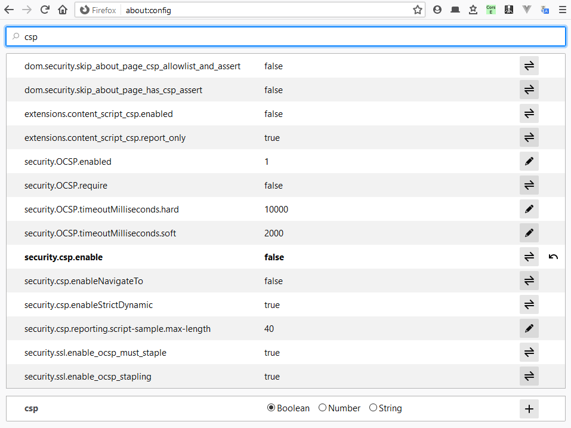

# JSquadBot

Automation-based chatbot that is able to read and answer messages from a browser-based chat such as WebWhatsApp.

It's not integrated directly with the chat API. Instead, it emulates the user in the browser and lets the webpage handle the requests. It was made like that not because it was the best approach, but for learning purposes.

Only WhatsApp is supported out of the box, but, since it was developed in MVVM, it should be easy to make it work anywhere else. Basically, you only need to implement [these methods](./CONTRIBUTING.md#methods-to-implement), which are responsible for handling the DOM.

Another advantage from the MVVM approach is that you can use only the functionality that matters to you. For instance, you can take only the View layer and use it for a purpose other than a chatbot.

## Usage

1. Install an extension to skip CORS in your browser, like _CORS Everywhere_. You can also figure out other ways to skip CORS.

1. Disable CSP. In Firefox, go to `about:config` and disable the option `security.csp.enable`.

	

1. Open a new tab in your browser and access the `clever bot` website so that your browser can load and send the required cookies.

1. Inject all the code from [jsquadbot.min.mjs](./jsquadbot.min.mjs) into the webpage. There are several ways to do that. The most straightforward one is to just copy and paste it into the browser console. Another way is to use a browser extension that allows JS code to be injected automatically.

The injected code does nothing until it's actually called. See the examples below.

### Examples

#### Step by step
```javascript
let cv = new ChatViewWhatsApp('Eliza');
// This class has methods that deal with the DOM.
// "Eliza" is the name or part of the name of the contact or group you want to attach the bot to.
// The ID should match only one chat.

let cc = new ChatController(cv);
// This class exposes higher level methods to manage the View.

await cc.addBot('HAL')
// Add a bot named "HAL" to the conversation with "Eliza".

chatControllerMap.set(cc);
// chatControllerMap is a global object of the class ChatControllerMap, which is derived from the native Map.
// This is the top level class that manages all chats and bots.
// There must be only 1 instance of ChatControllerMap, otherwise there will be concurrency problems.

await chatControllerMap.listen();
// Bot will start reading and answering messages that contain its name.
```

#### Short version
```javascript
chatControllerMap.set(new ChatController(new ChatViewWhatsApp('Eliza')));
await chatControllerMap.get('Eliza').addBot('HAL');
await chatControllerMap.listen();
```

#### Multiple bots and chats
```javascript
let cc1 = new ChatController(new ChatViewWhatsApp('Eliza'));
await cc1.addBot('HAL');
await cc1.addBot('Siri'); // second bot

let cc2 = new ChatController(new ChatViewWhatsApp('Alice')); // another chat
await cc2.addBot('Cortana'); // another bot

chatControllerMap.set(cc1, cc2); // add both chats at once
await chatControllerMap.listen(); // all 3 bots starts listening

let cc3 = new ChatController(new ChatViewWhatsApp('Bob')); // yet another chat
await cc3.addBot('Terminator');

chatControllerMap.set(cc3); // add chat. New bot starts listening
```

#### Using the lib for other purposes
```javascript
let view = new ChatViewWhatsApp('Bob');
await view.postMessage('Hello!'); // sends message to Bob
```
